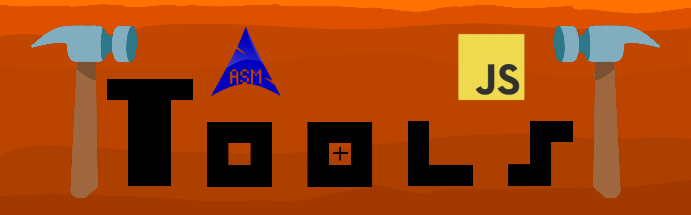

A collection of lightweight, client-side developer utilities running 100% in the browser.

**Live Site:** [fete3712-vmx.github.io/Tools/](https://fete3712-vmx.github.io/Tools/)

---

### Included Tools

* **CORS Playground** — Test, debug, and understand CORS requests and headers without setting up a test server.
* **Easy GitHub Actions** — Quickly generate ready-to-use GitHub Actions workflow YAML files.
* **Audio Compressor** — Compress audio files (optimized for `.wav`) directly in your browser without uploading data to external servers.
* **Live QR Code Generator** — Generate customizable QR codes in real-time.
