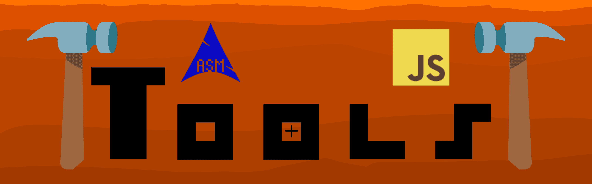

   
  
  
  
  
  
  

A collection of lightweight, client-side web tools.

**Live site:** https://fete3712-vmX.github.io/Tools/

## Included Tools

See the full directory in **[TOOLS.md](TOOLS.md)**.

### Featured

- **[EasyActions](https://fete3712-vmx.github.io/Tools/EasyActions/)** — Visual GitHub Actions workflow YAML generator.
- **[CORS Playground](https://fete3712-vmx.github.io/Tools/CORSPlayground/)** — Client-side CORS playground
- **[Gemini Playground](https://fete3712-vmx.github.io/Tools/GeminiAIPlayground/)** — In-browser testing Gemini.

## Notes

- 100% client-side: no files, tokens, or requests are sent to external servers.
- Free, open source, and ad-free.
